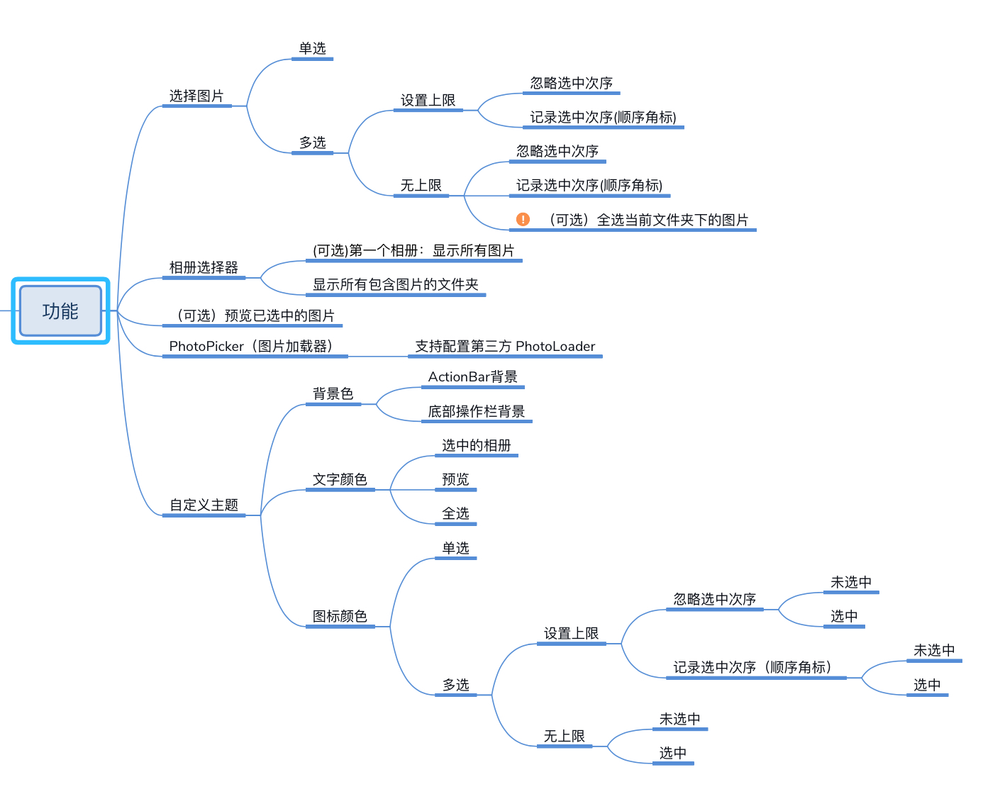
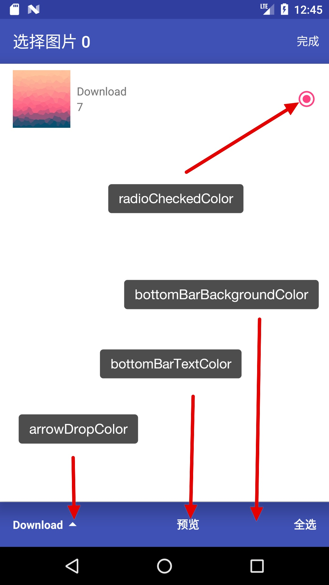
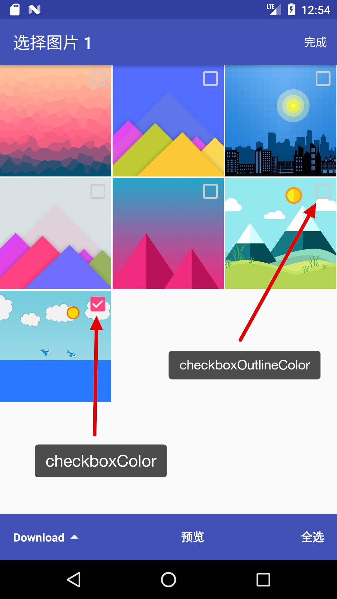
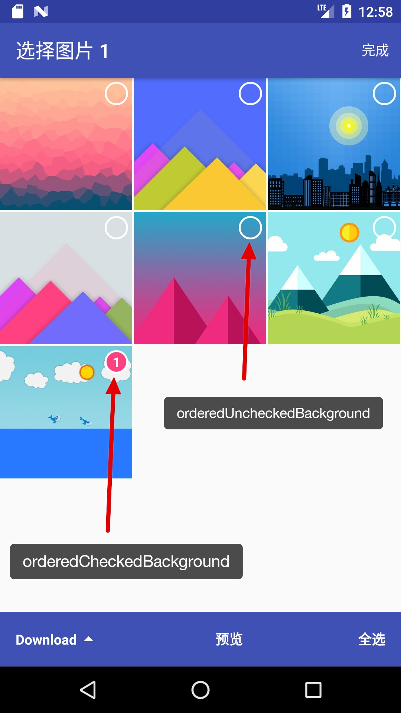

# PhotoPicker

## 项目介绍

PhotoPicker 是一个用 Kotlin 编写的轻量的 Android 图片选择器。

虽然 GitHub 上已经有很多图片选择器，比如 [Album][Album]、[Matisse][Matisse]、[PickPhotoSample][PickPhotoSample]、[RxGalleryFinal][RxGalleryFinal] 等这些优秀的开源库。经调研这些库在多选模式下只支持指定最大可选数量，并不支持无上限的多选模式。通常这种模式的使用场景确实比较少，然而我司的一款产品就有用户反馈过这个需求。并且我司正在开发的一款产品中也需要这个功能，为了复用这个功能模块，我的 PhotoPicker 就应运而生了。

目前 PhotoPicker 还只是 **alpha** 版本，如果你有好的建议欢迎提 issue 和 pull request。

[](https://jitpack.io/#Pigcasso/PhotoPicker) [](https://github.com/Pigcasso/PhotoPicker/blob/master/LICENSE)

##  功能

## 截屏

下载地址


Demo 截屏

|                                                              |                                                              |                                                              |                                                              |
| ------------------------------------------------------------ | ------------------------------------------------------------ | ------------------------------------------------------------ | ------------------------------------------------------------ |
|  |  |  |  |

## 下载

Gradle

第一步：

添加下面的代码到根目录 build.gradle：

```groovy
allprojects {
	repositories {
		...
		maven { url 'https://jitpack.io' }
	}
}
```

第二步，添加依赖到你的项目中：

```groovy
dependencies {
	implementation 'com.github.Pigcasso:PhotoPicker:0.1.2-alpha'
}
```


## 使用

PhotoPicker 的使用方法包括：单选模式、多选模式（设置上限）、多选模式（无上限）。

### 单选模式

```kotlin
// Kotlin
PhotoPicker
        .image(this)
        .singleChoice() // 单选模式
        .allPhotosAlbum(allPhotosAlbumCheck.isChecked) // 是否显示所有图片相册
        .preview(previewCheck.isChecked) // 是否开启预览功能
        .onResult(result) // 选择完成后的回调
        .onCancel(cancel) // 取消选择后的回调
        .start()
// Java
PhotoPicker
        .Companion
        .image(this)
        .singleChoice() // 单选模式
        .allPhotosAlbum(allPhotosAlbumCheck.isChecked) // 是否显示所有图片相册
        .preview(previewCheck.isChecked) // 是否开启预览功能
        .onResult(result) // 选择完成后的回调
        .onCancel(cancel) // 取消选择后的回调
        .start()
```

### 多选模式（设置上限）

```kotlin
// Kotlin
PhotoPicker
        .image(this)
        .multipleChoice() // 多选模式
        .upperLimit() // 设置上限
        .allPhotosAlbum(allPhotosAlbumCheck.isChecked) // 是否显示所有图片相册
        .preview(previewCheck.isChecked) // 是否开启预览功能
        .limitCount(limitCount) // 设置可选的上限数
        .countable(countableCheck.isChecked)
        .onResult(result) // 选择完成后的回调
        .onCancel(cancel) // 取消选择后的回调
        .start()
// Java
PhotoPicker
        .Companion
        .image(this)
        .multipleChoice() // 多选模式
        .upperLimit() // 设置上限
        .allPhotosAlbum(allPhotosAlbumCheck.isChecked) // 是否显示所有图片相册
        .preview(previewCheck.isChecked) // 是否开启预览功能
        .limitCount(limitCount) // 设置可选的上限数
        .countable(countableCheck.isChecked)
        .onResult(result) // 选择完成后的回调
        .onCancel(cancel) // 取消选择后的回调
        .start();
```

### 多选模式（无上限）

```kotlin
// Kotlin
PhotoPicker
        .image(this)
        .multipleChoice() // 多选模式
        .noUpperLimit() // 无上限
        .allPhotosAlbum(allPhotosAlbumCheck.isChecked) // 是否显示所有图片相册
        .preview(previewCheck.isChecked) // 是否开启预览功能
        .countable(countableCheck.isChecked) // 是否开启有序选择图片功能
        .selectableAll(selectableAllCheck.isChecked) // 是否开启选择全部功能
        .onResult(result) // 选择完成后的回调
        .onCancel(cancel) // 取消选择后的回调
        .start()
// Java
PhotoPicker
        .Companion
        .image(this)
        .multipleChoice() // 多选模式
        .noUpperLimit() // 无上限
        .allPhotosAlbum(allPhotosAlbumCheck.isChecked) // 是否显示所有图片相册
        .preview(previewCheck.isChecked) // 是否开启预览功能
        .countable(countableCheck.isChecked) // 是否开启有序选择图片功能
        .selectableAll(selectableAllCheck.isChecked) // 是否开启选择全部功能
        .onResult(result) // 选择完成后的回调
        .onCancel(cancel) // 取消选择后的回调
        .start();
```

## 配置

允许修改图片加载器和主题色

### 修改图片加载器

PhotoPicker 内置了一个简单的图片加载器 DefaultPhotoLoader。你也可以用`Glide`，`Picasso`等实现 。

请在项目中合适的位置（建议在 `Application` ）修改图片加载库，以 `Glide` 为例：

```kotlin
// 实现 PhotoLoader 接口
class GlidePhotoLoader : PhotoLoader {
    override fun loadPhoto(imageView: ImageView, imagePath: String, viewWidth: Int, viewHeight: Int) {
        Glide.with(imageView).load(imagePath).into(imageView)
    }
}

class App : Application() {
    override fun onCreate() {
        super.onCreate()
        // 修改图片加载库
        PhotoPicker.photoLoader = GlidePhotoLoader()
    }
}
```

### 修改主题色

请在项目中合适的位置（建议在`Application`中）修改主题色

```kotlin
class App : Application() {
    override fun onCreate() {
        super.onCreate()
        
        PhotoPicker.themeConfig = ThemeConfig()
                .radioCheckedColor(Color.RED)
                .bottomBarBackgroundColor(ContextCompat.getColor(this@App, R.color.colorPrimary))
                .bottomBarTextColor(Color.MAGENTA)
                .arrowDropColor(Color.CYAN)
                .checkboxColor(ContextCompat.getColor(this@App, R.color.colorAccent))
                .checkboxOutlineColor(ContextCompat.getColor(this@App, R.color.colorAccent))
        		.orderedCheckedBackground(R.drawable.ic_badge_checked_24dp)
                .orderedUncheckedBackground(R.drawable.ic_badge_unchecked_24dp)
    }
}
```

主题色对应的位置

|  |  |  |
| --------------------------------- | --------------------------------- | --------------------------------- |
|  |  |  |

替换有序角标的背景需要定义 drawable 资源文件，默认的有序角标 drawable 资源文件如下：

```xml
<!--选中: ic_badge_checked_24dp.xml-->
<?xml version="1.0" encoding="utf-8"?>
<shape xmlns:android="http://schemas.android.com/apk/res/android"
       android:shape="rectangle">

    <size
        android:width="@dimen/badge_size_width"
        android:height="@dimen/badge_size_height"/>

    <corners android:radius="@dimen/badge_corners_radius"/>

    <solid android:color="?colorAccent"/>

    <stroke
        android:width="@dimen/badge_stroke_width"
        android:color="@android:color/white"/>

</shape>

<!--未选中: ic_badge_unchecked_24dp.xml-->
<?xml version="1.0" encoding="utf-8"?>
<shape xmlns:android="http://schemas.android.com/apk/res/android"
       android:shape="rectangle">

    <size
        android:width="@dimen/badge_size_width"
        android:height="@dimen/badge_size_height"/>

    <corners android:radius="@dimen/badge_corners_radius"/>

    <stroke
        android:width="@dimen/badge_stroke_width"
        android:color="@android:color/white"/>

</shape>
```

## 混淆

```
-dontwarn zhuliang.photopicker.**
```

## 版权信息

    Copyright 2018 Picgasso
    
    Licensed under the Apache License, Version 2.0 (the "License");
    you may not use this file except in compliance with the License.
    You may obtain a copy of the License at
    
    http://www.apache.org/licenses/LICENSE-2.0
    
    Unless required by applicable law or agreed to in writing, software
    distributed under the License is distributed on an "AS IS" BASIS,
    WITHOUT WARRANTIES OR CONDITIONS OF ANY KIND, either express or implied.
    See the License for the specific language governing permissions and
    limitations under the License.

[Matisse]: https://github.com/zhihu/Matisse
[PickPhotoSample]: https://github.com/Werb/PickPhotoSample
[RxGalleryFinal]: https://github.com/FinalTeam/RxGalleryFinal
[Album]: https://github.com/yanzhenjie/Album
